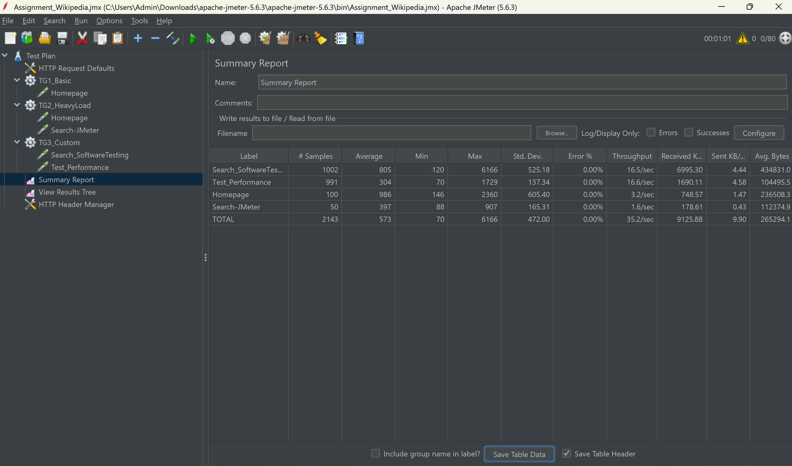

# Tuần 1: kết quả thực hành trải nghiệm chất lượng giao diện phần mềm với https://cantunsee.space/

# Tuần 2: Phân tích dữ liệu điểm số học sinh

## 1. Mô tả bài toán
Chương trình cung cấp lớp `StudentAnalyzer` để xử lý danh sách điểm số (từ 0.0 đến 10.0) với hai chức năng chính:
* **Đếm học sinh giỏi:** Đếm số lượng học sinh có điểm >= 8.0. Các giá trị điểm âm hoặc lớn hơn 10.0 sẽ bị loại bỏ (validate).
* **Tính điểm trung bình:** Tính trung bình cộng của các điểm số hợp lệ trong danh sách. Nếu danh sách rỗng hoặc không có điểm hợp lệ, trả về 0.

## 2. Cấu trúc thư mục
Dự án được tổ chức theo cấu trúc chuẩn:
* `src/`: Chứa mã nguồn xử lý logic (`StudentAnalyzer.java`).
* `test/`: Chứa các kịch bản kiểm thử đơn vị (`StudentAnalyzerTest.java`).
* `lib/`: Thư viện JUnit 5 dùng cho kiểm thử.

## 3. Hướng dẫn chạy chương trình và Kiểm thử (Test)

### Yêu cầu hệ thống:
* Java JDK 8 trở lên (Khuyến khích JDK 17 hoặc 21).
* IntelliJ IDEA hoặc bất kỳ IDE nào hỗ trợ Java.

### Các bước thực hiện:
1. **Mở dự án:** Mở thư mục `unit-test` bằng IntelliJ IDEA.
2. **Cấu hình thư viện:** Đảm bảo thư viện JUnit 5 đã được thêm vào Classpath.
3. **Chạy Kiểm thử:**
    * Tìm file `StudentAnalyzerTest.java` trong thư mục `test/`.
    * Chuột phải vào file hoặc class và chọn **Run 'StudentAnalyzerTest'**.
    * Kết quả sẽ hiển thị ở cửa sổ **Run** bên dưới. Nếu hiện thanh màu xanh lá cây (Passed), nghĩa là tất cả các ca kiểm thử đều thành công.

## 4. Các trường hợp kiểm thử (Test Cases)
Theo yêu cầu, chương trình thực hiện kiểm thử đầy đủ các nhóm sau:

### 4.1. Trường hợp bình thường
* **Danh sách hỗn hợp:** Chứa nhiều điểm hợp lệ và không hợp lệ (Ví dụ: 9.0, 8.5, 7.0, 11.0, -1.0).
* **Danh sách toàn bộ hợp lệ:** Tất cả các điểm đều nằm trong khoảng 0 - 10.

### 4.2. Trường hợp biên
* **Danh sách trống:** Kiểm tra xử lý khi không có dữ liệu đầu vào.
* **Giá trị biên tối thiểu/tối đa:** Danh sách chỉ chứa các điểm 0.0 hoặc 10.0.

### 4.3. Trường hợp ngoại lệ
* **Dữ liệu ngoài phạm vi:** Danh sách có điểm số < 0 hoặc > 10 để kiểm tra tính năng lọc điểm hợp lệ.

# Tuần 3: kết quả thực hành kiểm thử tự động End-to-End với Cypress
[![Xem Video kết quả]](./Resource/video/cypress-exercise.mp4)

# Tuần 4: Báo cáo Kiểm thử hiệu năng JMeter Website Wikipedia

## 1. Mục tiêu kiểm thử
Thực hiện kiểm thử hiệu năng trên trang https://en.wikipedia.org để đánh giá khả năng chịu tải và thời gian phản hồi của hệ thống.

## 2. Công cụ sử dụng
- **Công cụ:** Apache JMeter 5.6.3
- **Môi trường:** Java JDK 21

## 3. Kịch bản kiểm thử (Test Scenarios)

### Kịch bản 1: Truy cập cơ bản
- **Số lượng user:** 10
- **Số lần lặp:** 5
- **Mục tiêu:** Kiểm tra phản hồi trang chủ trong điều kiện tải nhẹ.

### Kịch bản 2: Tải nặng (Heavy Load)
- **Số lượng user:** 50
- **Ramp-up:** 30s
- **Mục tiêu:** Mô phỏng 50 người dùng cùng truy cập trang chủ và trang nội dung.

### Kịch bản 3: Stress Test theo thời gian
- **Số lượng user:** 20
- **Thời gian chạy:** 60 giây
- **Mục tiêu:** Kiểm tra độ ổn định khi gửi request liên tục vào các trang con.

## 4. Kết quả phân tích
*(Điền số liệu bạn thu được vào đây)*
- **Response Time trung bình:** ... ms
- **Throughput:** ... /sec
- **Tỷ lệ lỗi (Error Rate):** 0% (hoặc số khác)

## 5. Kết luận
- Hệ thống hoạt động ổn định với lượng user mô phỏng.
- Thời gian phản hồi nằm trong mức chấp nhận được.

## 6. Kết quả
Xem file script `.jmx` trong thư mục `/scripts`.

# Tuần 5: Dự án kiểm thử thủ công - Website Ecommerce

## 📝 Giới thiệu
Dự án thực hiện xây dựng bộ tài liệu kiểm thử QA từ đầu đến cuối cho hệ thống Website bán hàng Online.

## 👥 Thành viên nhóm
1. Đinh Hoàng Phi - QA Leader 
2. Lê Nguyễn Thanh Phúc - QA Designer
3. Nguyễn Trần Hùng - QA Designer
4. Vũ Minh - Tester
5. Trần Gia Phúc - Tester

## 📂 Cấu trúc dự án
- **/Test Plan**: Chiến lược và kế hoạch kiểm thử.
- **/Test Cases**: Bộ 45 kịch bản kiểm thử (Auth, Cart, Checkout).
- **/RTM**: Ma trận truy vết 16 yêu cầu hệ thống.
- **/Bug Reports**: Danh sách 10 lỗi giả lập (Severity: 2 Critical, 4 Major, 4 Minor).
- **/Test Report**: Tổng kết kết quả và quyết định Release.
- **/Test Metrics**: Các chỉ số đo lường chất lượng dự án.

## 📊 Tóm tắt kết quả
- **Tổng số Test Cases**: 45
- **Tỷ lệ thực thi**: 100%
- **Trạng thái**: **NO-RELEASE** (Còn 02 lỗi Critical chưa fix).